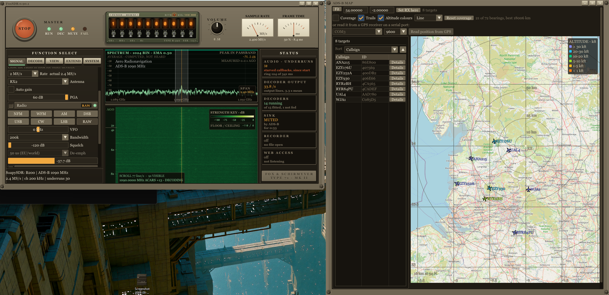
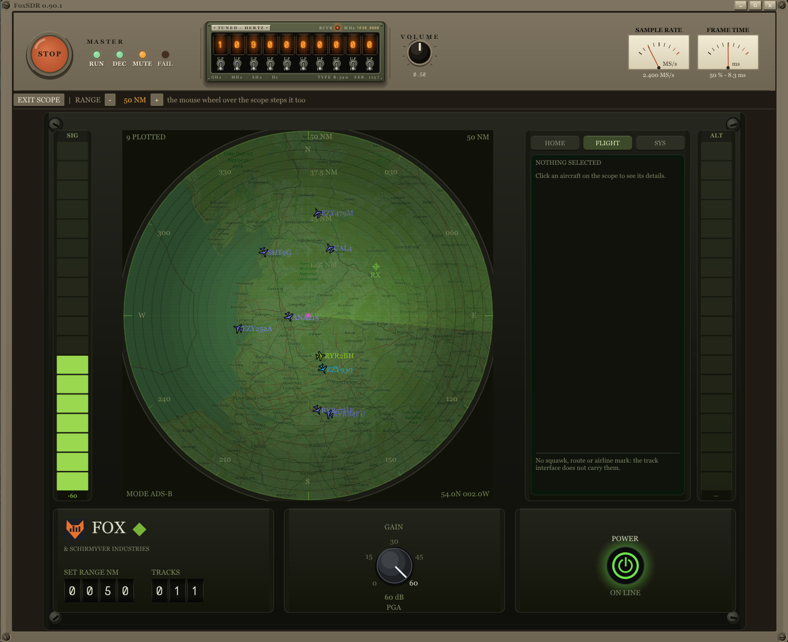
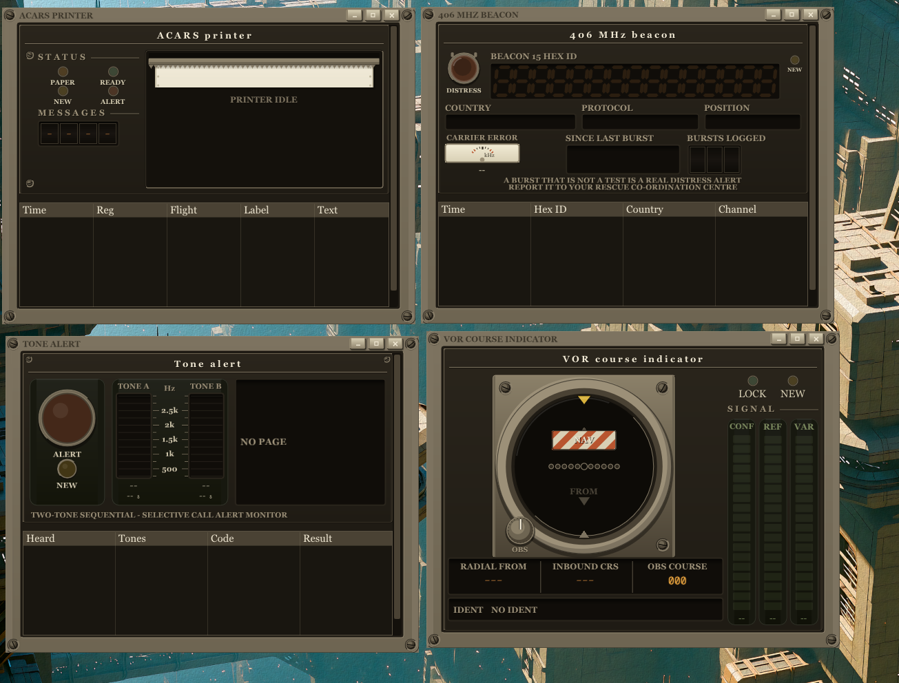

# FoxSDR

A free software-defined radio receiver for Windows and Linux. Spectrum and
waterfall, NFM, WFM, AM, DSB, USB, LSB and CW, stereo FM with RDS, a scanner,
an airband monitor that looks up any airport's control frequencies, audio and
I/Q recording, a map and a radar scope for decoded aircraft and ships, and 28
decoder plugins from an in-app catalogue. Most radios are driven by FoxSDR's
own drivers, so nothing else has to be installed. The whole interface can be
served to a browser on your own network.

The current release is **0.99.73** (October 2026), in open beta. Free for
noncommercial use; see [License](#license). Website:
[foxsdr.com](https://foxsdr.com).

*The receiver tuned to 1090 MHz with the ADS-B map open beside it.*

*The radar scope: the same ADS-B traffic as a 50 NM plan-position display.*

*Four plugin instruments: an ACARS printer, a 406 MHz beacon receiver, a
tone-alert monitor and a VOR course indicator.*

## Download

- **Windows:** `foxsdr-setup-<version>.exe` from the
  [latest release](https://github.com/wonderingStars/foxsdr/releases/latest),
  or FoxSDR in the [Microsoft Store](https://apps.microsoft.com/detail/9NBT95VMRVL2).
  The setup file is not code-signed yet, so SmartScreen shows "Windows
  protected your PC": choose **More info**, then **Run anyway**.
- **Linux:** the AppImage or the tarball from the same release. Install the udev
  rule from `installer/linux/` first
  ([installer/linux/README.md](installer/linux/README.md)).
- **No radio?** The built-in signal generator and I/Q file playback run without
  one.

Settings and plugins live in `%APPDATA%\foxsdr` and `%LOCALAPPDATA%\FoxSDR`;
recordings go to `Documents\SDR-recordings`. The uninstaller asks before it
removes any of them.

## Radios

| Radio | Driver | What it needs |
|---|---|---|
| RTL-SDR (including the Blog V4), HackRF One, Airspy R2 and Mini, Airspy HF+, Mirics MSi2500, RX888 mk2 | FoxSDR's own USB driver | Windows: bind the radio to WinUSB with Zadig (the RX888 twice). Linux: the udev rule. |
| HydraSDR RFOne | FoxSDR's own driver, written from the vendor's published sources. Not yet tested on hardware. | As above |
| SDRplay RSP1, RSP1A, RSP1B, RSP2, RSPduo, RSPdx, RSPdx-R2 | FoxSDR's own driver over the SDRplay API | The SDRplay API 3.07 or newer from sdrplay.com |
| ADALM-Pluto | FoxSDR's own driver over the network. Receives, and **transmits** CW, AM, NFM, USB and LSB. | Nothing |
| A remote RTL-SDR on an rtl_tcp server | FoxSDR's own client | Nothing |
| AOR AR5700D (AR2300, AR5001D, AR6000 with IQ5001) | FoxSDR's own driver, written from AOR's documentation. Not yet tested on hardware. | WinUSB on the I/Q interface |
| A sound card | For VLF below about 100 kHz, or as the I/Q input of a SoftRock-style front end | Nothing |
| Anything else: USRP, LimeSDR, ... | SoapySDR | A SoapySDR install (PothosSDR or radioconda) |

On Linux the USB drivers and the SDRplay driver are written and tested but have
not yet been confirmed against real hardware. Every driver, what it does and how
it was verified: [docs/HARDWARE.md](docs/HARDWARE.md).

## What it does

- **Receiver:** squelch, AGC, noise reduction, manual and automatic notch,
  de-emphasis, stereo FM with pilot lock and RDS, per-radio PPM correction, band
  plans for every ITU region, peak hold and average traces, markers on the
  waterfall.
- **Bookmarks and scanning:** tens of thousands of bookmarks, SDR# and CSV
  import, a scanner, and an Airband monitor that plays every control frequency
  of an airport at once.
- **Patch view:** build a receiver by hand on a canvas. Up to five radios,
  channels, demodulators, speakers, files, decoders and a map, all running
  together.
- **Instruments:** a bench oscilloscope for the audio and the I/Q, a radar scope
  for ADS-B traffic, and plugin instruments drawn as the equipment they are: a
  pager, a message printer, a VOR course indicator, a distress-beacon receiver.
- **Maps:** aircraft, ships and stations on one map, with trails, altitude
  colours, a coverage map and target details. Satellites get a map of their
  own.
- **CAT control:** a Hamlib rigctld server on port 4532 for logging and
  digital-mode software.
- **34 languages**, every shortcut rebindable (F7), and a 1960s bench-receiver
  look where colour has meaning: ivory is a control, amber a reading, green what
  the radio heard, rust a fault.

Full detail in [docs/MANUAL.md](docs/MANUAL.md).

## Plugins

Decoders are separate native plugins installed from the in-app **Plugin
store**: ADS-B, AIS, APRS, ACARS, POCSAG, FLEX, SSTV, WEFAX, weather
satellites, 406 MHz beacons and more, 37 in all, 24 of them on Linux too. Every
download is https and checked against the catalogue's SHA-256 before it becomes
a file. A plugin runs with the application's own privileges, its page says so,
and it may only retune the radio once you grant it. Writing one:
[docs/PLUGIN-API.md](docs/PLUGIN-API.md).

## Browser access

**Web access**, under EXTEND, serves the full interface with live audio to a
browser on your LAN. It is off by default. A password is required for any
binding beyond this machine, and there is no TLS: do not port-forward it to the
internet. Put a reverse proxy or a tunnel in front of it instead.

## Privacy

Usage reporting is on by default and sends anonymous counts only: version,
platform, session length, which modes, plugins and radio model were used,
against a random identifier that is deleted when you switch it off. It never
sends frequencies, anything decoded, your location or your IP address. Crash
and freeze reports are sent only with Diagnostics on, as text, never a memory
dump. [PRIVACY.md](PRIVACY.md) lists every field, and a test holds the payload
to it.

## Documentation

- [Using FoxSDR](docs/MANUAL.md): every feature, the keyboard, the patch view,
  plugins, airband, browser access, privacy, what happens when it crashes, and
  installing.
- [Radios and drivers](docs/HARDWARE.md): each native driver, what it does, and
  how far it has been verified.
- [Transmitting](docs/TRANSMITTING.md): the ADALM-Pluto transmitter and the
  rules about when it may be keyed.
- [Building from source](docs/BUILDING.md): Windows, Linux, the installer,
  nightlies and symbols.
- [Plugin API](docs/PLUGIN-API.md), [Diagnostics](docs/DIAGNOSTICS.md),
  [Releasing](docs/RELEASING.md), [Roadmap](PLAN.md).

Internal project and binary name: `cascade`. Built clean-room: no GPL code and
no GPL-linked dependencies anywhere in the tree.

## License

**Free for noncommercial use. Commercial use requires a paid licence.**

The application is licensed under the
[PolyForm Noncommercial License 1.0.0](LICENSE). Hobbyists, amateur radio
operators, students, charities, schools and public bodies may use, modify and
share it at no cost, with no registration, no licence key and no trial. Using
it in a business, selling it, bundling it with hardware or building a product
from it needs a commercial licence: [COMMERCIAL-LICENSE.md](COMMERCIAL-LICENSE.md)
has the tiers and [COMMERCIAL-AGREEMENT.md](COMMERCIAL-AGREEMENT.md) the terms.
The free licence is permanent: the project is funded by commercial licences,
which is what keeps it free for everybody else. A modified version stays
noncommercial-only and must carry the same terms and the `Required Notice:`
line.

`src/core/plugin_abi.h` is MIT, so anyone can write plugins. Bundled
third-party components keep their own permissive licences; see
`installer/THIRD-PARTY-LICENSES.txt`.

FoxSDR is an independent project, not affiliated with or endorsed by SDR++ or
its authors.
